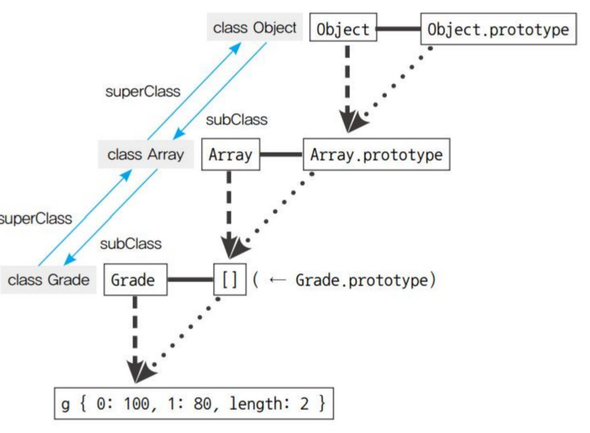

# 클래스

**자바스크립트는 프로토타입 기반 언어라서 '상속’ 개념이 존재하지 않습니다**

## 자바스크립트에서 클래스

생성자 함수 Array를 new 연산자와 함께 호출하면 인스턴스가 생성됩니다. 이때 Array를
일종의 클래스라고 하면，Array의 prototype 객체 내부 요소들이 인스턴스에 ‘상속’된다
고 볼 수 있습니다. 엄밀히는 상속이 아닌 프로토타입 체이닝에 의한 참조지만 결과적으
로는 동일하게 동작하므로 이렇게 이해해도 무방합니다. 한편 Array 내부 프로퍼티들 중
prototype 프로퍼티를 제외한 나머지는 인스턴스에 상속되지 않습니다.

인스턴스에 상속되는지（인스턴스가 참조하는지） 여부에 따라 스태틱 멤버 인스턴스 멤버로 나뉩니다
인스턴스 메서드라는 명칭은 혼란을 야기 할 수 있어서 자바스크립트의 특징을 살려 프로토타입 메서드라고 부릅니다.

## 클래스 상속

ES5까지의 자바스크립트에는 클래스가 없습니다.
자바스크립트에서 클래스 상속을 구현했다는 것은 결국 프로토타입 체이닝을 잘 연결한 것으로 이해하면 되는 것입니다.

### 클래스 상속과 프로토타입 체이닝의 관계

클래스에 있는 값이 인스턴스의 동작에 영향을 줘서는 안 되겠습니다. 사실 이런 영향을 줄 수 있다는 사실 자체가 이미 클래스의 추상성을 해치는 것입니다.

정사각형과 직사각형을 예시로 들자면 정사각형은 원래 직사각형에서 '네 변의 길이가 모두같다' 라는 구체적인 조건하나가 추가된 개념이므로 정사각형을 직사각형에 하위 클래스로 삼을 수 있습니다.

하위 클래스로 삼을 생성자 함수의 prototype에 상위 클래스의 인스턴스를 부여하는 것만으로도 기본적인 메서드 상속은 가능하지만 다양한 문제가 발생할 여지가 있어 안정성이 떨어집니다.

### 클래스가 구체적인 데이터를 지니지 않게 하는법

1. 제일 쉬운방법은 만들고 난후 프로퍼티들을 일일이 지우고 더는 새로운 프로퍼티를 추가할 수 없게 하는것.
2. 두번째 방법은 빈 생성자 함수(Bridge)를 하나 더 만들어서 그 prototype이 Superclass의 prototype을 바라보게끔 한 다음，SubClass의prototype에는 Bridge의 인스턴스를 할당하게 하는 것입니다
3. 끝으로 ES5 에서 도입된 Object.create를 이용한 방법을 소개합니다. 이 방법은 SubClass의 prototype의 _ proto_ 가 Superclass의 prototype을 바라보되, Superclass의 인스턴스가 되지는 않으므로 앞서 소개한 두 방법보다 간단하면서 안전합니다.
